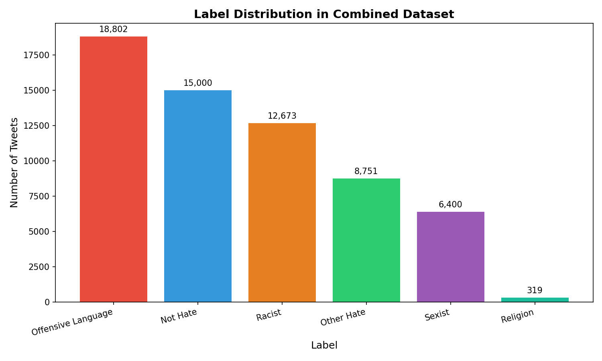
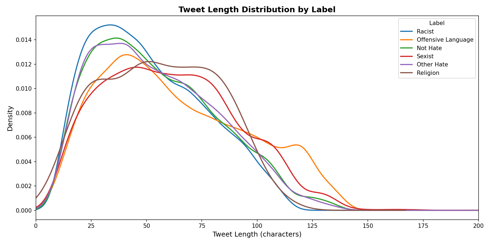
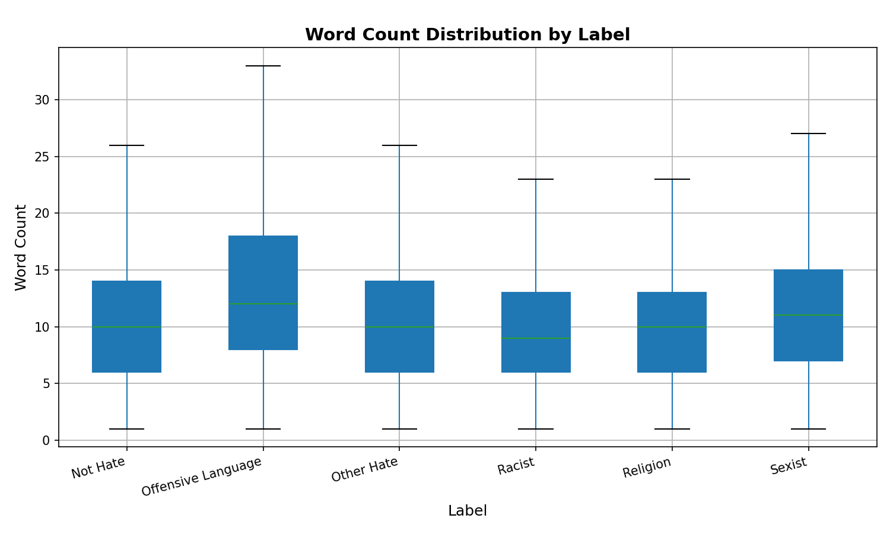
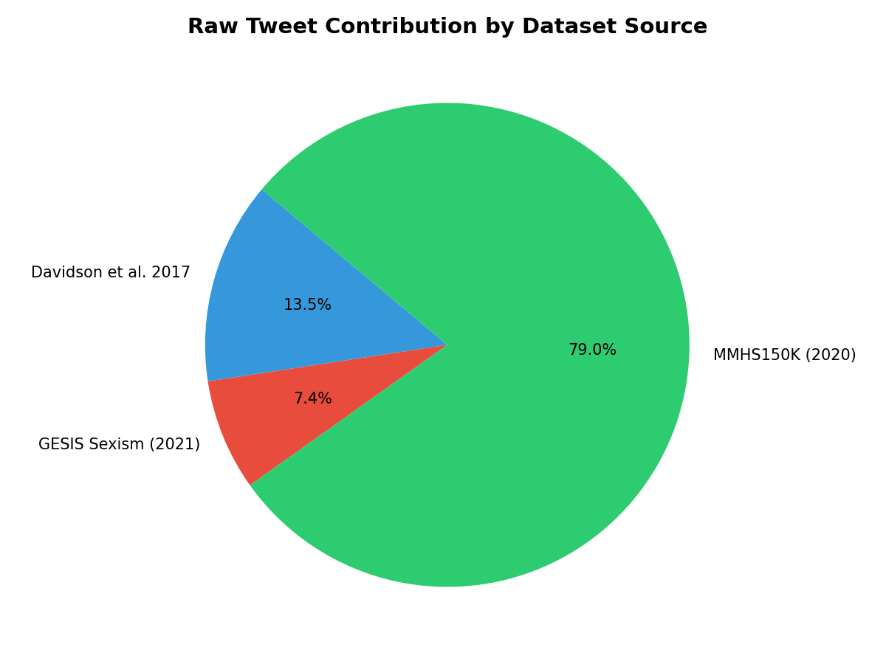

# IE 423 Term Project Proposal — Hate Speech in Social Media: Detecting Polarized Tweets Using Machine Learning

## Team Information

- Basil Mohammad A. Sadlah — 123203115
- Saleh Rami (Moh'd Saleh) Yaish — 121203025
- Parsa Badiee — 120203094
- Mohammed Saleh Mohammed Al-Hamami — 120203098

---

## Dataset Description

This project uses three publicly available, peer-reviewed datasets, merged into a single combined dataset.

### Dataset 1 — Davidson Hate Speech & Offensive Language (2017)
Obtained from: https://github.com/t-davidson/hate-speech-and-offensive-language

This dataset contains 24,783 English tweets labeled into three categories: hate speech, offensive language, and neither. It was published at ICWSM 2017 by researchers from Cornell University and has over 2,900 citations, making it one of the most widely used hate speech datasets in NLP research. We selected it because it provides strong coverage of offensive language and general hate speech.

**Why it is trustworthy:** Peer-reviewed, published at a top-tier AAAI conference, and cited by thousands of researchers worldwide.

### Dataset 2 — Call Me Sexist But / CMSB (2021)
Obtained from: https://doi.org/10.7802/2251 (GESIS Data Archive)

This dataset contains 13,631 English tweets labeled as sexist or not sexist, collected and annotated using psychological scales for sexism detection. It was published at ICWSM 2021 and is officially archived at GESIS, a major German academic social science institution. We selected it because it provides high-quality, theory-driven annotations for sexism specifically.

**Why it is trustworthy:** Peer-reviewed, published at ICWSM 2021, archived at an official academic data repository with a permanent DOI.

### Dataset 3 — MMHS150K (2020)
Obtained from: https://drive.google.com/file/d/1S9mMhZFkntNnYdO-1dZXwF_8XIiFcmlF/view

This dataset contains 149,823 tweets collected from Twitter using hate speech keywords from Hatebase, each annotated by three independent Amazon Mechanical Turk workers into six categories: Not Hate, Racist, Sexist, Homophobe, Religion, and Other Hate. Final labels were determined by majority vote. It was published at IEEE/CVF WACV 2020 and has over 260 citations. We selected it because it provides multi-category hate speech coverage and is the largest of our three sources.

**Why it is trustworthy:** Peer-reviewed, published at a top-tier IEEE/CVF computer vision conference, widely used as a benchmark in multimodal hate speech research.

---

## Dataset Access

The raw datasets are stored in: `data/raw/`

Due to file size limitations, raw files are not uploaded to GitHub directly. See `data/README.md` for download instructions for each dataset.

The processed and merged dataset is stored in: `data/processed/combined_dataset.csv`

---

## Research Questions

### Research Question 1
**Bias & Fairness in Detection: Do hate speech detection models exhibit bias toward certain groups, or topics when classifying polarized tweets on X?**

**Explanation:**
Hate speech detection models may unintentionally exhibit and show bias by disproportionately misclassifying content related to certain groups, or topics. This research question investigates whether models trained on polarized tweet datasets produce unequal error rates across different categories, such as specific identities, dialects, or forms of expression. For example, slang, reclaimed language, or minority dialects may be incorrectly flagged as harmful, while more subtle forms of hate may go undetected. Evaluating fairness involves analyzing false positives and false negatives across groups to identify systematic patterns of bias. This is important because biased models can reinforce existing inequalities and reduce trust in automated moderation systems.

### Research Question 2
**To what extent does incorporating hashtag information improve the detection of hate-related or polarized tweets compared to using text-only approaches?**

**Explanation:**
Detecting hate-related or polarized tweets using only the textual content can be challenging, as meaning is often influenced by additional signals embedded within the tweet itself. Hashtags, in particular, can provide important contextual cues by indicating the topic, sentiment, or underlying intent of a tweet, even when the text alone appears neutral or ambiguous. This research question investigates whether incorporating hashtag information alongside tweet text improves model performance in identifying hate-related content. By comparing models trained on text-only features with those that include hashtags as additional inputs, the study aims to evaluate whether hashtags help capture implicit or community-specific language patterns. This is especially relevant on X, where hashtags are frequently used to signal alignment, amplify opinions, or embed subtle forms of polarization.

### Research Question 3
**How does the severe class imbalance in religion-based hate speech (only 0.51% of the dataset) affect the ability of a machine learning model to learn meaningful patterns for this category, and what preprocessing strategies can mitigate this without distorting the overall dataset distribution?**

**Explanation:**
The Religion category in our combined dataset contains only 319 tweets out of 61,945 — a severe minority that risks being completely ignored by most standard classifiers. This is not a random artifact but a reflection of how rare religion-based hate speech is in the three source datasets, which were collected using different keyword strategies. This question is interesting because it sits at the intersection of data imbalance, ethical representation, and model fairness. A model that never predicts "Religion" is technically accurate on this class most of the time, but practically useless for detecting it. We will investigate various different techniques for adjustment during the modeling phase and determine whether we can meaningfully improve recall for this minority class without significantly degrading performance on the majority classes.

---

## Project Proposal

This project aims to investigate how machine learning can detect and categorize hate speech in social media tweets across multiple dimensions of prejudice, including racism, sexism, offensive language, religion-based hate, and other forms of harmful content.

First, we collected and merged three peer-reviewed, publicly available Twitter datasets into a unified corpus. We standardized label schemas across datasets, mapped all categories into a consistent six-class system, and applied text cleaning steps including lowercasing, URL removal, mention removal, hashtag normalization, punctuation removal, and whitespace normalization. We removed 18,176 duplicate and empty tweets after cleaning, and deliberately capped the dominant Not Hate class at 15,000 samples to prevent it from overwhelming the classifier during training — a decision grounded in the class imbalance literature and discussed explicitly in our preprocessing documentation.

Then, we conducted exploratory data analysis to understand label distributions, tweet length patterns, word count distributions across categories, and the relative contribution of each source dataset. Our EDA reveals that Offensive Language is the most represented category (30.35%), while Religion is severely underrepresented (0.51%), which will be an important challenge during modeling.

Based on our research questions, we plan to apply text vectorization methods such as TF-IDF or word embeddings, followed by multi-class classification models including Logistic Regression, Linear SVM, and potentially tree-based ensemble methods. Our goal is not only to build a model with strong classification metrics, but also to generate interpretable findings about what linguistic features drive each category of hate speech.

Possible challenges include the label noise introduced by merging datasets with different annotation frameworks, the severe imbalance of the Religion class, and the inherent subjectivity of hate speech annotation where reasonable annotators may disagree on borderline cases.

---

## Preprocessing Steps

### Step 1 — Loading the Raw Datasets
**Script:** `scripts/01_load_data.py`

All three raw datasets were loaded and inspected individually. We checked shapes, column names, missing values, and label distributions for each source before any merging or cleaning.

- Davidson dataset: 24,783 tweets, 7 columns, 0 missing values
- GESIS dataset: 13,631 tweets, 6 columns, 0 missing values
- MMHS150K dataset: 149,823 tweets, 5 columns, 0 missing values

### Step 2 — Label Standardization
**Script:** `scripts/02_preprocess_data.py`

Each dataset used a different labeling system. We mapped all labels to a unified six-class schema:

| Original Label | Source | Mapped To |
|---|---|---|
| Class 0 (Hate Speech) | Davidson | Other Hate |
| Class 1 (Offensive Language) | Davidson | Offensive Language |
| Class 2 (Neither) | Davidson | Not Hate |
| True (Sexist) | GESIS | Sexist |
| False (Not Sexist) | GESIS | Not Hate |
| 0 (Not Hate) | MMHS150K | Not Hate |
| 1 (Racist) | MMHS150K | Racist |
| 2 (Sexist) | MMHS150K | Sexist |
| 3 (Homophobe) | MMHS150K | Dropped |
| 4 (Religion) | MMHS150K | Religion |
| 5 (Other Hate) | MMHS150K | Other Hate |

**Note on Homophobe class:** We deliberately excluded the Homophobe category from our dataset. This decision was made because LGBTQ+-related language is highly context-dependent — slurs reclaimed by community members, neutral usage, and genuinely hateful content can look identical at the surface level. Including this category risked training a model that flags non-hateful LGBTQ+ content as hate speech, which would be both inaccurate and harmful.

### Step 3 — Text Cleaning
**Script:** `scripts/02_preprocess_data.py`

We applied the following cleaning steps to all tweet texts:
- Lowercasing
- Removing URLs (`http`, `www`)
- Removing @mentions
- Removing punctuation
- Removing digits
- Stripping extra whitespace

### Step 4 — Removing Duplicates and Empty Tweets
**Script:** `scripts/02_preprocess_data.py`

After text cleaning, 18,176 rows were removed:
- Duplicate tweets (same text across different sources)
- Empty tweets (text reduced to empty string after cleaning)

### Step 5 — Capping the Not Hate Class
**Script:** `scripts/02_preprocess_data.py`

The Not Hate class contained 132,406 tweets after cleaning — representing over 80% of the combined dataset. This level of imbalance would cause most classifiers to default to predicting Not Hate for nearly every input, achieving high accuracy while completely failing to detect actual hate speech.

We capped the Not Hate class at **15,000 samples** (randomly sampled with `random_state=42` for reproducibility). This brings it in line with other majority classes while still providing ample training signal.

### Step 6 — Adding Engineered Features
**Script:** `scripts/02_preprocess_data.py`

Two simple features were added to support EDA:
- `tweet_length` — number of characters in the cleaned tweet
- `word_count` — number of words in the cleaned tweet

### Step 7 — Saving Processed Data
**Script:** `scripts/02_preprocess_data.py`

The cleaned dataset was saved to: `data/processed/combined_dataset.csv`

---

## Initial Outputs

### Dataset Shape
After preprocessing, the dataset contains **61,945 rows** and **4 columns** (`tweet_text`, `label`, `tweet_length`, `word_count`).

### Label Distribution


| Label | Count | Percentage |
|---|---|---|
| Offensive Language | 18,802 | 30.35% |
| Not Hate | 15,000 | 24.22% |
| Racist | 12,673 | 20.46% |
| Other Hate | 8,751 | 14.13% |
| Sexist | 6,400 | 10.33% |
| Religion | 319 | 0.51% |

### Tweet Length Distribution


Tweet lengths follow an approximately normal distribution with a right tail, with a mean of 57 characters and a standard deviation of 29 characters. The minimum is 3 characters and the maximum is 203 characters.

### Word Count Distribution by Label


### Dataset Source Contribution


### Summary Table
Generated by `scripts/03_basic_eda.py` and saved to `outputs/tables/01_label_summary.csv`.

| Label | Count | Avg Length | Avg Words | Percentage |
|---|---|---|---|---|
| Offensive Language | 18,802 | 62.94 | 12.88 | 30.35% |
| Not Hate | 15,000 | 54.68 | 10.67 | 24.22% |
| Racist | 12,673 | 50.97 | 10.00 | 20.46% |
| Other Hate | 8,751 | 54.68 | 10.32 | 14.13% |
| Sexist | 6,400 | 61.02 | 11.76 | 10.33% |
| Religion | 319 | 55.93 | 9.82 | 0.51% |

### Known Limitation — Label Noise
During manual inspection of the combined dataset, we identified instances of label noise — tweets that appear to belong to a different category than their assigned label. This is a well-documented issue in hate speech research that arises when combining datasets annotated under different frameworks and by different annotator pools. For example, a tweet containing racial slurs was labeled as Sexist because it was sourced from the GESIS sexism dataset, where annotators were primed to detect sexism. These inconsistencies cannot be resolved manually at scale (61,945 tweets) and are acknowledged as an inherent limitation of our dataset construction approach. We will address this during the modeling phase using noise-robust training techniques.

---

## Transparency and Traceability

All outputs presented in this markdown file are generated from the Python scripts in the `scripts/` folder.
Figures are stored in `outputs/figures/`, tables are stored in `outputs/tables/`, and the cleaned dataset is stored in `data/processed/`.
The repository is designed so that another user can reproduce all outputs by installing the required packages and running the scripts in order.

---

## How to Run the Project

### 1. Clone the repository
```bash
git clone https://github.com/BILGI-IE-423/ie423-2025-2026-termproject-daspace-mockers
cd ie423-2025-2026-termproject-daspace-mockers
```

### 2. Install required packages
```bash
pip install -r requirements.txt
```

### 3. Place the datasets
Download the three raw datasets following the instructions in `data/README.md` and place them inside `data/raw/`.

### 4. Run the scripts in order
```bash
python scripts/01_load_data.py
python scripts/02_preprocess_data.py
python scripts/03_basic_eda.py
```

All outputs will be saved automatically to `outputs/figures/` and `outputs/tables/`.
